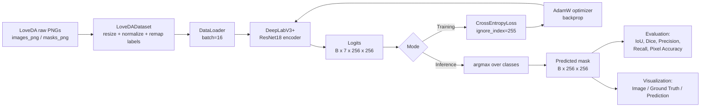
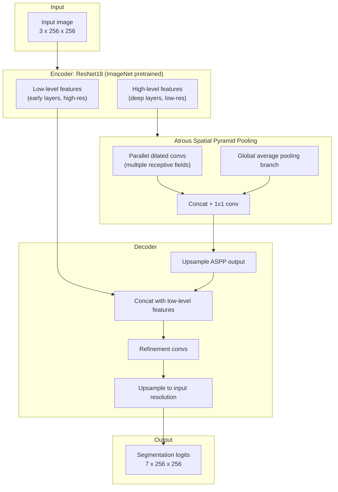

# LoveDA Semantic Segmentation Pipeline

A DeepLabV3+ (ResNet18 encoder) pipeline for semantic segmentation of satellite imagery on the **LoveDA** dataset, covering both **Urban** and **Rural** scenes.

---

## 1. Dataset

**LoveDA — Land-cOVEr Domain Adaptive semantic segmentation dataset**

- Satellite images of Chinese cities, split into two scene domains:
  - `Urban`
  - `Rural`
- Provided as `Train`, `Val`, and `Test` splits, each containing both scenes.
- Directory layout expected by the pipeline:

```
DATASET_ROOT/
└── <Split>/<Split>/
    ├── Urban/
    │   ├── images_png/   # RGB satellite tiles
    │   └── masks_png/    # per-pixel class label PNGs
    └── Rural/
        ├── images_png/
        └── masks_png/
```

- `Test` split has no masks (used for held-out inference only).

### Classes

| ID | Class       |
|----|-------------|
| 0  | Background  |
| 1  | Building    |
| 2  | Road        |
| 3  | Water       |
| 4  | Barren      |
| 5  | Forest      |
| 6  | Agriculture |

`NUM_CLASSES = 7`

---

## 2. How the data is processed

Each `(image, mask)` pair goes through `LoveDADataset.__getitem__` in `dataset.py`:

1. **Image**
   - Load as RGB (`PIL.Image`).
   - Resize to `256×256` with **bilinear** interpolation.
   - Scale pixel values to `[0, 1]`.
   - Normalize with ImageNet statistics:
     - `mean = [0.485, 0.456, 0.406]`
     - `std  = [0.229, 0.224, 0.225]`
   - Convert to a `(C, H, W)` `float32` tensor.

2. **Mask (ground truth)**
   - Load as a single-channel label PNG.
   - Resize to `256×256` with **nearest-neighbor** interpolation (never interpolate label maps — it would invent fractional/incorrect classes at boundaries).
   - Raw LoveDA masks use `0 = ignore/no-data` and classes `1–7`.
   - **Re-mapped** to be model-friendly:
     - valid pixels: `label - 1` → classes become `0–6`
     - originally-`0` pixels → set to `255` (**ignore index**, excluded from loss and metrics)

3. **Scene label**
   - `Urban = 0`, `Rural = 1` (stored per-sample; available for scene-aware analysis, not used as a training target by default).

4. **Batching**
   - `DataLoader` with `batch_size=16`, `shuffle=True` (train) / `False` (val), `pin_memory=True`.

---

## 3. How data is passed through the pipeline



**Module responsibility map:**

| Stage | File | Function(s) |
|---|---|---|
| Load & preprocess | `dataset.py` | `LoveDADataset`, `get_datasets`, `get_dataloaders` |
| Build model | `model.py` | `build_model` |
| Train / checkpoint | `train.py` | `train_one_epoch`, `validate_one_epoch`, `train_model`, `load_best_model` |
| Evaluate | `evaluate.py` | `calculate_iou`, `calculate_segmentation_metrics` |
| Visualize | `visualize.py` | `show_prediction` |
| Orchestrate | `main.py` | `run_pipeline` |

---

## 4. Model architecture

**DeepLabV3+** with a **ResNet18** encoder (ImageNet-pretrained), built via `segmentation_models_pytorch`.



**Configuration** (`config.py`):

| Setting | Value |
|---|---|
| Architecture | DeepLabV3+ |
| Encoder | ResNet18 |
| Encoder weights | ImageNet |
| Input channels | 3 |
| Output classes | 7 |
| Loss | `CrossEntropyLoss(ignore_index=255)` |
| Optimizer | AdamW (`lr=1e-4`, `weight_decay=1e-4`) |
| Epochs | 30 |
| Batch size | 16 |
| Input resolution | 256 × 256 |

---

## 5. Ground truth

The ground truth is a **per-pixel class map**, same spatial size as the input (`256×256`), where every pixel holds an integer label:

- `0–6` → one of the 7 LoveDA classes (Background, Building, Road, Water, Barren, Forest, Agriculture)
- `255` → **ignore label**, pixels with no valid annotation in the original data (mapped from raw label `0`). These pixels are excluded from both the loss computation and every reported metric.

Ground truth comes directly from the `masks_png` files that accompany each image in the `Train` and `Val` splits. The `Test` split has no ground truth — it exists purely for producing predictions on unseen data.

---

## 6. Output

The model outputs **dense per-pixel class predictions**, produced in two stages:

1. **Raw output (logits):** shape `(B, 7, 256, 256)` — one score per class per pixel.
2. **Predicted mask:** `argmax` over the class dimension → shape `(B, 256, 256)`, each pixel holding the predicted class ID (`0–6`).

This predicted mask is:
- Compared against the ground-truth mask to compute evaluation metrics.
- Rendered alongside the original image and ground truth in `visualize.py` for qualitative inspection.

### Metrics reported (`evaluate.py`)

| Metric | Description |
|---|---|
| Per-class IoU / mIoU | Intersection-over-Union, per class and averaged |
| Dice / mean Dice | F1-equivalent overlap score |
| Precision / Recall | Per-class, macro-averaged |
| Pixel Accuracy | Overall correct-pixel fraction |
| Mean Pixel Accuracy | Per-class accuracy, averaged |
| Frequency-Weighted IoU | IoU weighted by each class's pixel frequency |

All metrics ignore pixels labeled `255`.

---

## 7. Running the pipeline

```bash
pip install -r requirements.txt

python main.py                     # train + evaluate + visualize
python main.py --skip-train        # load best checkpoint, skip training
python main.py --epochs 10         # override epoch count
python main.py --dataset-root /path/to/loveda
```
# 13. Validation Results The following results were obtained using the best validation checkpoint. 
### No TTA vs. Flip-Averaged TTA 
| Class       | IoU (No TTA) |  IoU (TTA) | Dice (No TTA) | Dice (TTA) | Precision (No TTA) | Precision (TTA) | Recall (No TTA) | Recall (TTA) |
| ----------- | -----------: | ---------: | ------------: | ---------: | -----------------: | --------------: | --------------: | -----------: |
| Background  |       0.5004 | **0.5125** |        0.6670 | **0.6777** |             0.6343 |      **0.6404** |          0.7033 |   **0.7196** |
| Building    |       0.5439 | **0.5665** |        0.7046 | **0.7233** |             0.6174 |      **0.6402** |          0.8204 |   **0.8311** |
| Road        |       0.5309 | **0.5428** |        0.6935 | **0.7037** |             0.7229 |      **0.7393** |          0.6665 |   **0.6714** |
| Water       |       0.6417 | **0.6523** |        0.7818 | **0.7896** |             0.7192 |      **0.7273** |          0.8563 |   **0.8635** |
| Barren      |       0.3322 | **0.3455** |        0.4988 | **0.5136** |             0.5182 |      **0.5443** |          0.4808 |   **0.4861** |
| Forest      |       0.3618 | **0.3669** |        0.5314 | **0.5369** |             0.4971 |      **0.5048** |          0.5707 |   **0.5733** |
| Agriculture |       0.5165 | **0.5238** |        0.6812 | **0.6875** |             0.8363 |      **0.8434** |          0.5746 |   **0.5803** |
| **Mean**    |   **0.4896** | **0.5015** |    **0.6512** | **0.6617** |                  — |               — |               — |            — | 
### Overall Metrics 
| Metric             | No TTA |   With TTA | Absolute Improvement |
| ------------------ | -----: | ---------: | -------------------: |
| **Mean IoU**       | 0.4896 | **0.5015** |          **+0.0119** |
| **Mean Dice**      | 0.6512 | **0.6617** |          **+0.0105** |
| **Pixel Accuracy** | 0.6717 | **0.6815** |          **+0.0098** |
